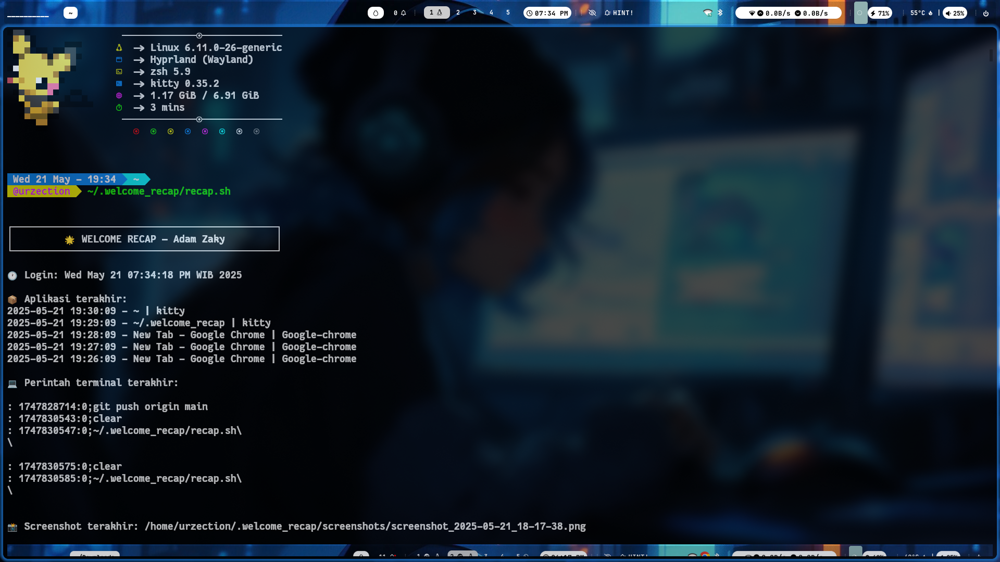

# 🖥️ Welcome Recap — Terminal Login Recap Screenshot [beta, starin ae biar gwejh lanjut]

Skrip terminal sederhana yang menampilkan **rekap aktivitas desktop** setiap kali kamu membuka terminal (zsh/bash), termasuk:

- Nama aplikasi yang sedang terbuka
- Screenshot terbaru dari desktop angda
- Perintah terakhir di terminal
- Dukungan tampilan gambar langsung dalam terminal seperti `kitty` atau `wezterm`

---

## ✨ Fitur

- ⏱️ Logger aplikasi aktif tiap 10 menit (`app_logger.sh`)
- 📸 Screenshot otomatis desktop tiap 30 menit(trigger waktunya edit aja bjir diline terakhir, tinggal ganti angka) (`auto_screenshot.sh`)
- 📋 Rekap langsung muncul saat buka terminal (`recap.sh`)
- 🖼️ Mendukung terminal `kitty`/`wezterm` (untuk saat ini req ae) untuk preview gambar
- 📄 Cronjob otomatis saat instalasi

---

## 🖼️ Preview

Kalau kamu pakai terminal `kitty`, nanti tampilannya bakal kayak gini:

.

---

## 📦 Instalasi

### 1. Clone repository-nya

```bash
git clone https://github.com/adamzakys/welcome-recap.git ~/.welcome_recap
cd ~/.welcome_recap
```

### 2. Instal aplikasi yang dibutuhkan

Minimal kamu butuh:

- `xdotool` → buat deteksi aplikasi yang aktif  
- `gnome-screenshot` → buat ambil screenshot (kalau kamu pakai Wayland, bisa pakai `grim`)  
- Terminal yang support gambar kayak `kitty` atau `wezterm`

#### Kalau kamu pakai Ubuntu/Debian:

```bash
sudo apt update
sudo apt install xdotool gnome-screenshot
```

### 3. Langsung instal skripnya

```bash
bash install.sh
```

Yang bakal dilakukan:

- Nambah cronjob biar `auto_screenshot.sh` & `app_logger.sh` jalan otomatis tiap 10 menit
- Masukin pemanggilan `recap.sh` ke `.zshrc` atau `.bashrc`, jadi tiap buka terminal langsung tampil

---

## ❌ Uninstall

Gampang banget bro:

```bash
bash uninstall.sh
```

Yang bakal dihapus:

- Cronjob otomatis
- Folder `~/.welcome_recap` beserta isinya
- Baris script `recap.sh` dari `.zshrc` atau `.bashrc`

---

## ⚙️ Catatan Tambahan

- Gambar cuma tampil kalau terminal kamu support (`kitty`, `wezterm`) (sementara)
- Screenshot bakal disimpan di:

  ```
  ~/.welcome_recap/screenshots/
  ```

- Log aplikasi disimpan di:

  ```
  ~/.welcome_recap/log_apps.txt
  ```

---

## ☕ Kontribusi

Punya ide fitur keren atau nemu bug? Langsung bikin PR atau issue aja ya cuy!  
Boleh juga fork dan modif suka-suka.

---

## 📜 Lisensi

MIT License — bebas dipakai, dimodif, dan dibagiin.  
Kalau bisa sih tetap kasih kredit, biar sama-sama terkinil awkwwk
